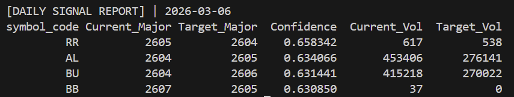
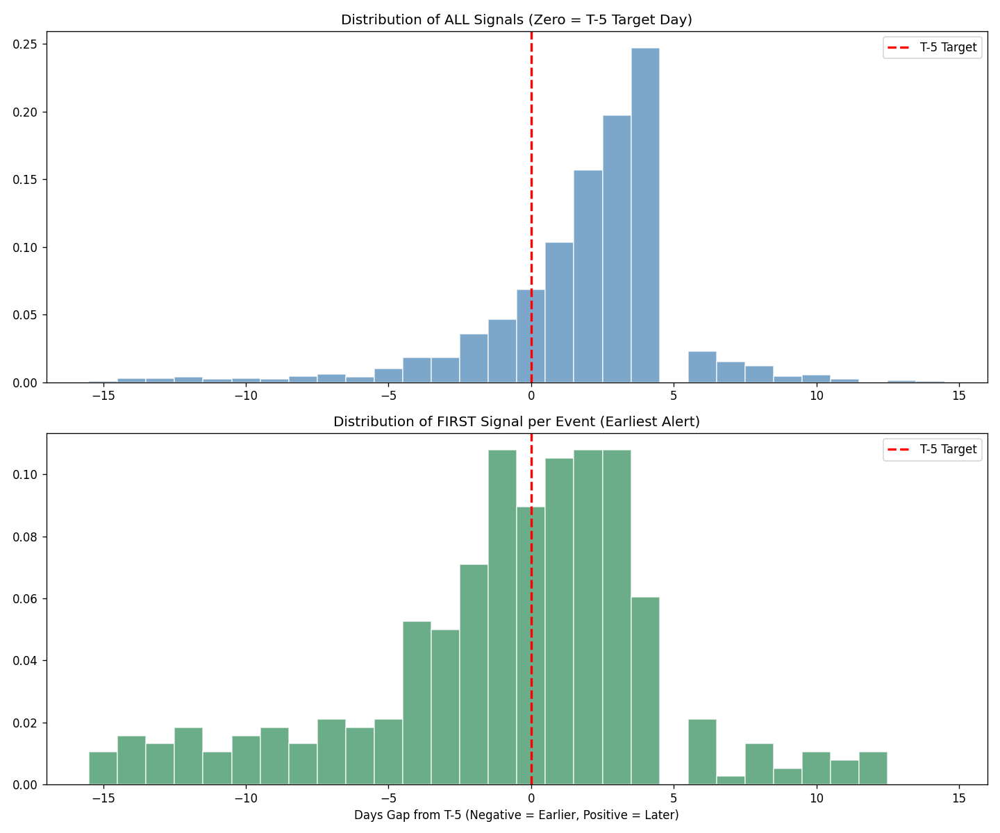

# Test Report

## 输出逻辑
- 模型预测T+5各个合约是主力合约的概率并排序，如果得到的T+5的主力合约和当前T时刻的主力合约不一致则报信号

## Basic Results
- 测试时间范围：2025-06-30以后
- 所有商品总计换月659个，预测信号1403次
- 视换月前后的两个合约都匹配为match的条件
   - recall = #(match) / #(real) = 86.82%
   - precision = #(match) / #(pred) = 90.04%
   - 误差来自于换月前后两个合约volume比较相近可能导致概率预测结果交错，以及volume变化混乱的品种

- 目标是T+5，但信号有滞后，将其看作T+3的信号可以解释超过85%

